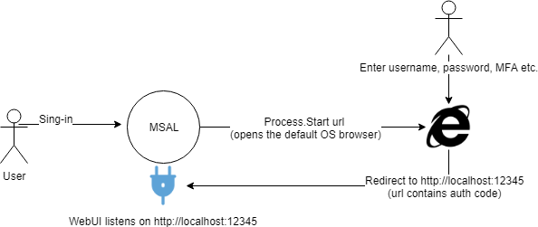

This sample is for MSAL 3.x and previous MSAL versions do not support it.

# .NET Core application signing in users interactively (Windows, Linux, Mac) with Microsoft and calling the Microsoft Graph

This simple sample demonstrates how to use the [Microsoft Authentication Library (MSAL) for .NET](https://github.com/AzureAD/microsoft-authentication-library-for-dotnet) to get an access token and call the Microsoft Graph (using OAuth 2.0 against the Azure AD v2.0 endpoint).

This sample is pre-configured. If you just want to quickly run it just:

1. Clone the code.
```
  git clone https://github.com/Azure-Samples/active-directory-dotnet-desktop-msgraph-v2.git
```

2. Build and run using the `dotnet` command line or using Visual Studio or Visual Studio Code 

### Notes about the user experience

On most platforms, MSAL is able to pop-up a browser by hosting it in an UI panel. .NET core does not have an UI controls. 
This solution uses the OS default browser, which is started as a separate process. Implications of this are: 

- MSAL does not have control over the browser, e.g. MSAL cannot close the window, cannot detect if the user decides to navigate away etc. The app using MSAL can only set a cancellation token / timeout.
- On succesful navigation to the redirect URI, the application can write a message back to the browser. The experience can be futher enhanced by redirecting the browser to a page of your choice. 
- In order to capture the result of the authentication, MSAL listens to a localhost socket. Applications must register "http:\\localhost" as a redirect uri.
- B2C does not support localhost redirect uri.

### [Optional] Use your own application coordinates
If you want to use your own application coordinates, please follow these instructions:

#### Choose the Azure AD tenant where you want to create your applications

1. Sign in to the [Azure portal](https://portal.azure.com) using either a work or school account or a personal Microsoft account.
1. If your account gives you access to more than one tenant, select your account in the top right corner, and set your portal session to the desired Azure AD tenant
   (using **Switch Directory**).
1. In the left-hand navigation pane, select the **Azure Active Directory** service, and then select **App registrations (Preview)**.

#### Register the client app 

1. Navigate to the Microsoft identity platform for developers [App registrations](https://go.microsoft.com/fwlink/?linkid=2083908) page.
1. Select **New registration**.
   - In the **Name** section, enter a meaningful application name that will be displayed to users of the app, for example `NetCoreApp`.
   - In the **Supported account types** section, select **Accounts in any organizational directory and personal Microsoft accounts (e.g. Skype, Xbox, Outlook.com)**.
    - Select **Register** to create the application.
1. On the app **Overview** page, find the **Application (client) ID** value and record it for later. You'll need it to configure the Visual Studio configuration file for this project.
1. In the list of pages for the app, select **Authentication**.
   - In the **Redirect URLs**, add a new **Public client (mobile & desktop)** uri to http://localhost
 1. Select **Save**.
1. Configure Permissions for your application. To that extent in the list of pages click on **API permissions**
   - click the **Add a permission** button and then,
   - Ensure that the **Microsoft APIs** tab is selected
   - In the *Commonly used Microsoft APIs* section, click on **Microsoft Graph**
   - In the **Delegated permissions** section, ensure that the right permissions are checked: **User.Read**. Use the search box if necessary.

#### Configure the code to use your application's coordinates

Open Program.cs and replace the ClientID string constant with the application / client ID for the app you just registred

### System diagram


